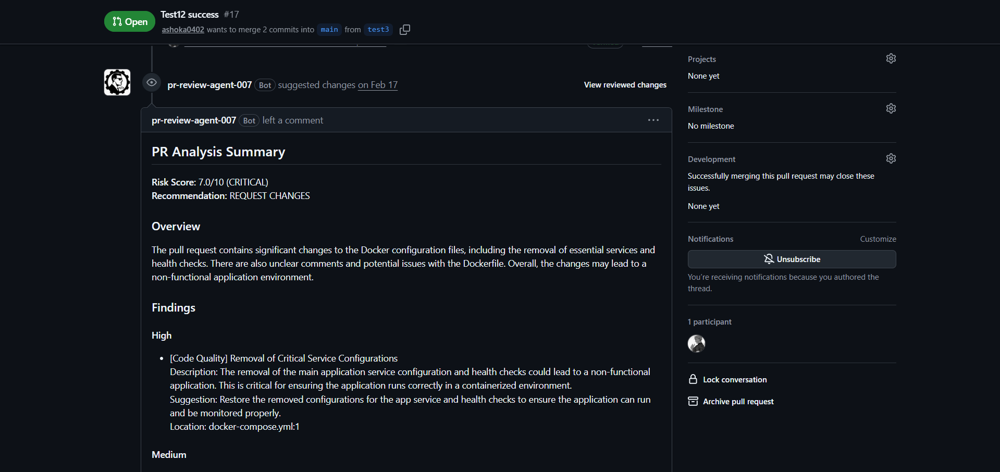
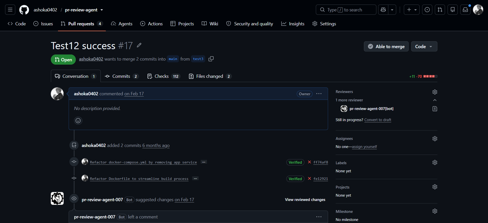

# PR Review Agent


<p align="center">
  <table>
    <tr>
      <td valign="middle">
        
      </td>
      <td valign="middle" width="35"></td>
      <td valign="middle">
        <a href="https://github.com/apps/pr-review-agent-007">
          <strong>⬇️ INSTALL PR REVIEW AGENT</strong>
        </a>
      </td>
    </tr>
  </table>
</p>


### AI-Powered GitHub Pull Request Review with Static Analysis & Agentic Reasoning

An AI-powered GitHub App that automatically analyzes Pull Requests by combining deterministic static analysis with LLM-based reasoning. It parses PR diffs, detects risk signals, runs code-quality and security checks, evaluates review confidence, and posts structured feedback directly to GitHub.

<p align="center">
  
</p>

<p align="center">
  <i>Proof of work: automated code review posted directly on a GitHub Pull Request</i>
</p>

---

## Why This Project?

Static-analysis tools are reliable for known patterns but can lack context. LLMs can understand intent and relationships across a change, but their output needs structure and confidence controls.

This project combines both:

```text
             GitHub Pull Request
                      │
                      ▼
               Webhook Handler
                      │
                      ▼
                 PR Context
                      │
          ┌───────────┴───────────┐
          ▼                       ▼
   Static Analysis          Risk Detection
          │                       │
          └───────────┬───────────┘
                      ▼
                LLM Reasoning
                      │
                      ▼
             Confidence Check
                      │
                ┌─────┴─────┐
                │           │
              Good       Uncertain
                │           │
                ▼           ▼
              Publish    Refine
                            │
                            ▼
                       Final Review
                            │
                            ▼
                    GitHub Comments
```

The goal is to make automated code review **evidence-driven, context-aware, and actionable**.

---

# Key Features

### GitHub Integration

- GitHub App authentication
- Webhook signature verification
- Pull Request event processing
- PR diff and file retrieval
- Inline review comments
- Approve / Request Changes / Comment recommendations

### Static Analysis

- Flake8 and Pylint for code quality
- Bandit for security analysis
- Cyclomatic complexity analysis
- Maintainability analysis
- Diff-level analysis

### Risk Analysis

The agent detects contextual risk signals such as:

- Large Pull Requests
- Security-sensitive files
- Critical file patterns
- Database migrations
- Missing tests
- Dependency impact
- Circular dependencies

### Agentic Review

- Tool-based analysis pipeline
- LLM reasoning over PR context and static-analysis evidence
- Confidence evaluation
- Bounded refinement loop
- Schema-driven structured review output

### Review Output

Each review can include:

- Overall summary
- Risk score
- Severity and category
- File and line location
- Explanation
- Suggested fix
- Inline GitHub comments
- Final review recommendation

---

# Proof of Work

## Automated GitHub Review

The complete workflow runs from a GitHub Pull Request to an actionable review.

<p align="center">
  
</p>

```text
GitHub PR
   ↓
Webhook
   ↓
FastAPI
   ↓
Background Processing
   ↓
PR Reviewer
   ↓
Static Analysis + Risk Analysis
   ↓
LLM Reasoning
   ↓
Confidence Evaluation
   ↓
Review Formatter
   ↓
GitHub Review API
   ↓
Inline Comments + Summary
```

---

## Example Review

<p align="center">
  
</p>

Example:

```text
Risk Score: 6.5 / 10
Risk Level: Medium-High

Findings:
- Security issue
- Code quality issue
- Complexity warning

Recommendation:
REQUEST CHANGES
```

For line-specific findings:

<p align="center">
  
</p>

---

# High-Level Design

```text
┌──────────────────────────────────────────────────────────────┐
│                         GitHub                               │
│                  Pull Request / Webhook                      │
└─────────────────────────────┬────────────────────────────────┘
                              │
                              ▼
┌──────────────────────────────────────────────────────────────┐
│                    FastAPI Webhook Layer                     │
│              Signature Verification + Validation             │
└─────────────────────────────┬────────────────────────────────┘
                              │
                              ▼
┌──────────────────────────────────────────────────────────────┐
│                  Background Review Processor                 │
└─────────────────────────────┬────────────────────────────────┘
                              │
                              ▼
┌──────────────────────────────────────────────────────────────┐
│                       PR Reviewer Agent                      │
│                                                              │
│   ┌──────────────┐   ┌──────────────┐   ┌────────────────┐  │
│   │ Diff Parser  │   │ Risk         │   │ GitHub Client  │  │
│   │              │   │ Detector     │   │                │  │
│   └──────┬───────┘   └──────┬───────┘   └───────┬────────┘  │
│          │                  │                   │           │
│          └──────────────────┼───────────────────┘           │
│                             ▼                               │
│                  ┌────────────────────┐                     │
│                  │ Static Analysis    │                     │
│                  │                    │                     │
│                  │ Flake8 / Pylint   │                     │
│                  │ Bandit             │                     │
│                  │ Complexity         │                     │
│                  └─────────┬──────────┘                     │
│                            │                                │
│                            ▼                                │
│                  ┌────────────────────┐                     │
│                  │   LLM Reasoning    │                     │
│                  │ Schema-Driven      │                     │
│                  │ Review Generation  │                     │
│                  └─────────┬──────────┘                     │
│                            │                                │
│                            ▼                                │
│                  ┌────────────────────┐                     │
│                  │ Confidence         │                     │
│                  │ Evaluation         │                     │
│                  └─────────┬──────────┘                     │
│                            │                                │
│                       ┌────┴────┐                           │
│                       │         │                           │
│                     Pass      Refine                        │
│                       │         │                           │
│                       │         ▼                           │
│                       │   Bounded Iteration                 │
│                       │         │                           │
│                       └────┬────┘                           │
│                            ▼                                │
│                  ┌────────────────────┐                     │
│                  │ Review Formatter   │                     │
│                  └─────────┬──────────┘                     │
└────────────────────────────┼─────────────────────────────────┘
                             │
                             ▼
┌──────────────────────────────────────────────────────────────┐
│                       GitHub Review                           │
│              Summary + Inline Comments + Decision            │
└──────────────────────────────────────────────────────────────┘
```

### Design Decisions

**1. Webhook-first architecture**

GitHub events trigger the system instead of requiring developers to manually run a review command.

**2. Deterministic analysis before LLM reasoning**

Static-analysis findings and risk signals provide evidence that the LLM can reason over.

**3. Background processing**

The webhook endpoint acknowledges the event while the more expensive review pipeline runs asynchronously.

**4. Bounded agentic reasoning**

The confidence evaluator can trigger refinement, but the number of iterations is capped to avoid uncontrolled inference.

**5. Structured output**

The LLM response is converted into a structured review model before it is published to GitHub.

---

# Agentic Review Flow

The reviewer is more than a single LLM call.

```text
              Initial Review
                    │
                    ▼
           Confidence Evaluator
                    │
             ┌──────┴──────┐
             │             │
          Confident      Uncertain
             │             │
             ▼             ▼
          Publish       Re-analyze
                           │
                           ▼
                      Refined Review
                           │
                           ▼
                    Confidence Check
                           │
                           ▼
                    Final Publication
```

The maximum number of agent iterations is configurable, with the project using a bounded default to keep the process predictable.

---

# Engineering Challenges

## 1. Combining Static Analysis with LLM Reasoning

Static-analysis tools can identify concrete issues, but they do not always understand the intent of a change.

Instead of relying entirely on the LLM, the system supplies deterministic findings as evidence:

```text
Linting
Security
Complexity
Risk Signals
Dependency Analysis
       │
       ▼
   LLM Context
       │
       ▼
Context-Aware Review
```

This reduces the need for the model to rediscover issues that deterministic tools can already identify.

---

## 2. Balancing Review Quality and Inference Cost

A single LLM pass can miss context, while unlimited refinement can increase latency and cost.

The agent therefore uses:

```text
Initial Review
      ↓
Confidence Evaluation
      ↓
Refine only when necessary
      ↓
Hard iteration limit
```

This creates a controlled reasoning loop instead of an unrestricted agent.

---

## 3. Mapping AI Findings Back to Code

A useful code-review system needs more than a text summary.

Findings are associated with:

```text
Repository
   ↓
Pull Request
   ↓
Changed File
   ↓
Changed Line
   ↓
Review Comment
```

This allows developers to see feedback directly beside the relevant code in GitHub.

---

# Example: Security Finding

Given:

```python
def get_user(user_id):
    query = f"SELECT * FROM users WHERE id = {user_id}"
    return db.execute(query)
```

The review agent can surface:

```text
Severity: Critical
Category: Security

Potential SQL injection vulnerability.

User-controlled input is directly interpolated into the SQL query.
Use a parameterized query instead.
```

The finding can then become an inline GitHub review comment on the affected line.

---

# Technology Stack

| Layer | Technology |
|---|---|
| Backend | Python, FastAPI |
| GitHub | GitHub App, Webhooks, REST API |
| Static Analysis | Flake8, Pylint, Bandit, Radon |
| AI | LLM-based structured review |
| Validation | Pydantic |
| Deployment | Docker, Docker Compose |
| Observability | Structured logging, metrics |
| CI/CD | GitHub Actions |

---

# Project Structure

```text
pr-review-agent/
│
├── app/
│   ├── main.py
│   ├── config.py
│   ├── dependencies.py
│   │
│   ├── api/                 # API routes and webhooks
│   ├── github/              # GitHub authentication and client
│   ├── analysis/            # Diff parsing and risk analysis
│   ├── static_analysis/     # Linting, security, complexity
│   ├── llm/                 # LLM integration and schemas
│   ├── agent/               # Agentic reasoning
│   ├── review/              # Review scoring and formatting
│   └── observability/       # Logs and metrics
│
├── docker/
├── scripts/
├── .github/workflows/
├── docker-compose.yml
├── requirements.txt
├── .env.example
└── README.md
```

---

# Running Locally

### 1. Clone

```bash
git clone https://github.com/ashoka0402/pr-review-agent.git
cd pr-review-agent
```

### 2. Install Dependencies

```bash
python -m venv .venv
```

Windows:

```powershell
.venv\Scripts\activate
```

Linux/macOS:

```bash
source .venv/bin/activate
```

```bash
pip install -r requirements.txt
```

### 3. Configure Environment

Copy `.env.example` to `.env` and configure the required GitHub App and LLM credentials.

### 4. Run

```bash
uvicorn app.main:app --reload --host 0.0.0.0 --port 8000
```

For local GitHub webhook testing, expose the application through an HTTPS tunnel such as ngrok.

---

# GitHub App Flow

```text
Developer creates/updates PR
              │
              ▼
        GitHub Webhook
              │
              ▼
      Signature Validation
              │
              ▼
       Background Review
              │
              ▼
        Review Published
```

The application handles Pull Request events such as:

- `opened`
- `synchronize`
- `reopened`

---

# Development

Run tests:

```bash
pytest
```

Run static checks:

```bash
bash scripts/run_static_checks.sh
```

Format:

```bash
black app/ --line-length 120
isort app/ --profile black
```

Type checking:

```bash
mypy app/ --ignore-missing-imports
```

---

# What This Project Demonstrates

This project goes beyond a basic "LLM + GitHub API" integration.

It demonstrates:

- Event-driven backend architecture
- GitHub App development
- Webhook signature verification
- Background processing
- PR diff parsing
- Static code analysis
- Security scanning
- Risk scoring
- LLM orchestration
- Agentic reasoning
- Confidence-based refinement
- Structured outputs
- Inline GitHub review publishing
- Docker deployment
- Observability
- CI/CD

---

# License

MIT License

---

# Author

**Harshit Singh**

[GitHub](https://github.com/ashoka0402)
